<p align="center">
  
</p>

# cursor-harness

<p align="center"><strong>A developer’s time is precious. Automate my Workflows.
Days are for Devs, Nights for the agents.</strong></p>

A **portable**, project-agnostic pack of Cursor **rules**, **skills**, **agents**,
**hooks**, a **night-shift CLI**, and **automation stubs**. Cursor is the current
coding platform. Your **app** stack stays yours. A short **prep** (about 2h max,
anytime) assembles the workpack. **Nightshift** then runs fully autonomously in
the human-created worktrees. You test and ship when you are back.

Required consumer file: [`harness.project.yaml`](templates/harness.project.yaml).

Agents share a root **summary** file, [`project_memory.md`](templates/project_memory.example.md).
After a cycle, human **lessons learned** become scored **Candidates**. Later sessions
load matching rows and bump `help_count` when a lesson actually helped — so the pack
learns what was useful, not only what was written down.

Inspired by:

| Source | Exceptionally good for |
| --- | --- |
| [Matt Pocock](https://github.com/mattpocock) | Teaching agents real engineering habits, not demo ware |
| [Learn Harness Engineering](https://walkinglabs.github.io/learn-harness-engineering/en/) | Designing a harness, not dumping prompts |
| [Dexter Horthy — 12-Factor Agents](https://github.com/humanlayer/12-factor-agents) | Production agent architecture (control flow, context, tools) |
| [Anthropic Skills](https://github.com/anthropics/skills) | Canonical `SKILL.md` shape; docs, data, and design starters |
| [superpowers](https://github.com/obra/superpowers) | A full spec → plan → TDD → review loop that runs itself |
| [Karpathy Skills](https://github.com/multica-ai/andrej-karpathy-skills) | Stopping overbuild; surgical diffs that only touch what must change |
| [Skills for Real Engineers](https://github.com/mattpocock/skills) | Everyday coding skills: grill, TDD, tickets, not vibe-coding demos |
| [UI/UX Pro Max](https://github.com/nextlevelbuilder/ui-ux-pro-max-skill) | Giving the agent design sense so web and mobile UI stop looking templated |
| [caveman](https://github.com/JuliusBrussee/caveman) | Terse agent talk and fewer output tokens |
| [Addy Osmani’s Agent Skills](https://github.com/addyosmani/agent-skills) | Production SDLC skills: spec, test, review, ship |
| [Taste Skill](https://github.com/Leonxlnx/taste-skill) | Distinctive output instead of generic, safe, boring slop |
| [Awesome Claude Skills](https://github.com/ComposioHQ/awesome-claude-skills) | Finding other packs worth installing |
| [I Have ADHD](https://github.com/ayghri/i-have-adhd) | Short, scannable answers that lead with the next action |

```bash
git clone git@github.com:RaphaelBecker/cursor-harness.git vendor/cursor-harness
echo 'vendor/cursor-harness' >> .gitignore
./vendor/cursor-harness/install.sh --target . --init --mode symlink --with-agents
```

Flags and troubleshooting: [docs/install.md](docs/install.md). Product policy stays in
consumer local overrides.

## The big picture

**One path.** Flavor is a contract `kind` (`feature` / `bug` / `architecture`), not
a second slash. Zoom: [Workflows](#workflows). Proposed next: [Workflow ideas](#workflow-ideas).
Marks: [legend](#legend).

| You want | You type |
| --- | --- |
| Build anything | `/prep` → `/implementation-plan-review` → approve → Cursor Build (or `/night-shift`) → `/ship-local` (worktree) or `/ship-prod` (already on default) |
| Fire / status | `/night-shift` |
| Cheat sheet | `/help` |

### 1 · Prep — `/prep`

Anytime. Keep it short (about **2h max**). You create Cursor worktrees. Packet of
questions. **No code.**



 ·  · 

[`prep`](skills/workflows/prep/SKILL.md)
· [`grill-me`](skills/grill-me/SKILL.md)
· [`implementation-plan-review`](skills/implementation-plan-review/SKILL.md)

**↓ One approved contract per existing worktree**

### 2 · Night fire — `/night-shift` (or Cursor Build)

One local `agent -p` per approved tree, **or** Cursor Build in the prep chat
(same `@execute-approved-plan` skill). Fire is the unattended multi-tree launcher.
Skipping fire is fine for one-tree attended work. Agents do not create worktrees.
Count is however many trees you prepared (machine-bound; about **3** has been comfortable).


 ·  · 

[`night-shift`](skills/workflows/night-shift/SKILL.md)
· [`execute-approved-plan`](skills/execute-approved-plan/SKILL.md)
· [`review-code`](skills/review-code/SKILL.md)
· [`blast-radius`](skills/blast-radius/SKILL.md)
· [`sync-spec-docs`](skills/sync-spec-docs/SKILL.md)
· [`verifier`](agents/verifier.md)
· Bugbot

**↓ You test when you are back, then you ship**

### 3 · Review and ship

You trigger ship. Nightshift never merges.


 ·  · 

[`ship-local`](skills/ship-local/SKILL.md)
· [`blast-radius`](skills/blast-radius/SKILL.md)
· [`ship-prod`](skills/workflows/ship-prod/SKILL.md)
· [`project-memory`](skills/project-memory/SKILL.md)
· ci-investigator
· Bugbot

<p id="legend" align="center">
 playbook
&nbsp;·&nbsp;
 you decide
&nbsp;·&nbsp;
 always-on
&nbsp;·&nbsp;
 helper
</p>

Charts are compiled SVGs (dark-slate cards). Edit [`docs/diagrams/*.mmd`](docs/diagrams/),
run [`scripts/render-diagrams.sh`](scripts/render-diagrams.sh), commit the SVG. Do not
hand-edit the SVG. Do not paste live mermaid into this README.

**How parallel work runs**

- **You** create each Cursor **worktree + branch** (one tree, one agent, one feature).
  Agents do not create, switch, or delete worktrees. The night-shift CLI does not
  either. The only exception is `/ship-local`, which you trigger — it may merge this
  feature and remove **this** worktree only.
- **Prep (anytime, about 2h max):** `/prep` packets → you `/implementation-plan-review` →
  you approve. That yes does **not** authorize merge, push, or production. It does
  authorize local commits in that tree. Set `kind` on the contract (`feature` default,
  `bug`, or `architecture`).
- **Nightshift:** `night-shift fire` — tests first, smallest code, `testing` ladder
  (**worktree proof** on the feature tree), review, docs, lessons. Fully autonomous
  in those worktrees. Agent **stops** at ready-for-manual-test (or parks
  `BLOCKED.md`). Hard stop never waits for you. Merge-ready = green worktree proof
  (or docs N/A), not idle-main complete.
- **Parallelism:** number of night agents = number of approved worktrees. Bound by
  this machine. About **3** has been comfortable on a laptop — a reference, not a
  cap. If the project declares `slots` in `harness.project.yaml` (scarce test DB),
  **worktree proof** waits for a pool lease only when a listed suite needs it.
  Pure unit/UI must not take a slot. Do not skip tests.
- **After:** `night-shift status` (skim `decisions.tsv`) → you manual-test →
  `/ship-local` (repeat; leftover-commit if already on default) → one **idle-main
  complete** on idle local default (wait a live test-pool lease, bounded) →
  `/ship-prod`. No force-push. No skipped gates. `/ship-prod` classifies this
  checkout's leftovers and continues.
- **Summary file:** every handoff writes `## Lessons learned` in `HANDOFF.md`.
 Chat last line is `DONE` or `PARTIAL: <exact leftover>`.
`@project-memory` upserts those into `project_memory.md` (commit with the feature)
and counts `help_count` when a later cycle actually used the row.

## Contents

| Doc                                             | What it is                                             |
| ----------------------------------------------- | ------------------------------------------------------ |
| [The big picture](#the-big-picture) (this file) | Whole cycle at a glance                                |
| [Legend](#legend) (this file)                   | Skill, HIL, rule, helper marks                         |
| [Workflows](#workflows) (this file)             | The one delivery path + named side paths               |
| [Workflow ideas](#workflow-ideas) (this file)   | Proposed sequences (not installed)                     |
| [docs/architecture.md](docs/architecture.md)    | Portable vs local, layout, install model               |
| [docs/runtime-policy.md](docs/runtime-policy.md)| Local CLI/SDK vs Cursor VMs, Origin, Automations       |
| [docs/install.md](docs/install.md)              | Submodule install, flags, troubleshooting              |
| [docs/rules.md](docs/rules.md)                  | Rule catalog                                           |
| [docs/skills.md](docs/skills.md)                | Skill catalog                                          |
| [docs/agents.md](docs/agents.md)                | Subagents + built-in reviewers                         |
| [docs/hooks.md](docs/hooks.md)                  | Hook catalog                                           |
| [docs/automations.md](docs/automations.md)      | Nightly hygiene stubs (local CLI/SDK)                  |
| [HARNESS.md](HARNESS.md)                        | Agent inventory (one line each) → `.cursor/HARNESS.md` |
| [CONTRIBUTING.md](CONTRIBUTING.md)              | Add a pack; how to re-render charts                    |
| [LICENSE](LICENSE)                              | MIT                                                    |

**Templates** (copy into the consumer project, do not edit harness filenames in place):
[`harness.project.yaml`](templates/harness.project.yaml) (required) ·
[AGENTS.md](templates/AGENTS.md) ·
[project_memory.example.md](templates/project_memory.example.md) ·
[doc-routing.local.example.mdc](templates/doc-routing.local.example.mdc) ·
[local-override.example.mdc](templates/local-override.example.mdc) ·
[night-shift contract](templates/night-shift-contract.example.md) ·
[night decision log](templates/night-shift-decisions.example.tsv) ·
[launchd unit](templates/launchd/com.cursor-harness.night-shift.plist.example)

**Night CLI** (not installed into `.cursor/`): [runtime/night-shift](runtime/night-shift).

**Prompt pack** (installed, not a catalog): [automations/README.md](automations/README.md).

## Workflows

Start each one in a new agent chat (`/name` after install). Each skill should do
**one** job well — orchestrators only sequence.

| You want | You type |
| --- | --- |
| Assemble the workpack | `/prep` |
| Fire / status | `/night-shift` or `runtime/night-shift` |
| Merge locally, then production | `/ship-local` then `/ship-prod` |
| Faster, less flaky tests | `/test-harness-optimize` (not delivery) |
| Hygiene without a feature plan | Local CLI/SDK (`docs/runtime-policy.md`) |
| Architecture report | `/architecture-audit` (report; not delivery) |
| Whole-repo scorecard | `/codebase-health-audit` (`quality-audit` pack) |
| Cheat sheet, new workflow, pull lab process | `/help` · `/create-workflow` · `/sync` |

`kind` on the night contract picks the extra inner skills:

| `kind` | Extra inside `/prep` | Extra inside `@execute-approved-plan` |
| --- | --- | --- |
| `feature` (default) | packet grill | BDD if `bdd` pack, else acceptance tests |
| `bug` | `@diagnose-bug` until one named red command exists, then grill. Tiny one-file skip only if **you** ask | failing regression first |
| `architecture` | `@architecture-audit` → you pick **one** smell → grill. Allowlist = one extract **or** one cycle fix | `@extract-deep-module` **or** `@dependency-direction-fix` |

### Prep — `/prep`

Anytime. About **2h max**. You already opened Cursor worktrees. Packet of
questions (recommended answers filled). You approve contracts. **No code.** CLI
never creates trees.

Fire when the workpack is ready: `./vendor/cursor-harness/runtime/night-shift fire`

Orchestrator: [prep](skills/workflows/prep/SKILL.md)

### Nightshift — `/night-shift`

Unattended `agent -p` in each approved tree. When you are back: `night-shift status`
then manual tests.

Orchestrator: [night-shift](skills/workflows/night-shift/SKILL.md) ·
CLI: [runtime/night-shift](runtime/night-shift)

### Ship — `/ship-local` then `/ship-prod`

Shipping is always **your** call. The agent never pushes or deploys on its own.

Orchestrators: [ship-local](skills/ship-local/SKILL.md) ·
[ship-prod](skills/workflows/ship-prod/SKILL.md)

### Anytime

| You want | You type |
| --- | --- |
| What can I run? | `/help` — map: [HARNESS.md](HARNESS.md) · words: `/glossary` |
| Understand a written plan | `/summarize-plan` |
| Add a new named sequence | `/create-workflow` |
| Pull proven process from a live project into this pack | `/sync` |

## Workflow ideas

Not installed. Author with `/create-workflow` when you want them live.
**One job per skill.** Orchestrators only sequence.

| Idea | You would type | Point |
| --- | --- | --- |
| Optimize test suite | `/optimize-test-suite` | Honest green runs; split flakes / coverage / lint |
| Frontend refactor | `/frontend-refactor` | Corporate tokens, one UI family per run |
| Docs to user stories | `/docs-to-user-stories` | Stories + tests; retire tech dupes only when covered |
| App performance | `/performance-optimize` | Measure, then one hotspot |

Do not add a skill that “improves architecture” or “makes the app faster” in
general. Ship stays `/ship-local` then `/ship-prod`.

## Quick install

Full flags, clone, CI, troubleshooting: [docs/install.md](docs/install.md).

```bash
git clone git@github.com:RaphaelBecker/cursor-harness.git vendor/cursor-harness
echo 'vendor/cursor-harness' >> .gitignore
./vendor/cursor-harness/install.sh --target . --init --mode symlink --with-agents
```

Requires `bash`, `python3` (stdlib), and `git`. Default packs: `core`. Add more
names under `packs:` in `harness.project.yaml` (or `--packs all`). Preferred
layout: gitignored vendor clone. Submodule alternative: [docs/install.md](docs/install.md).

## Layout

```text
cursor-harness/
├── README.md           # one path + this contents table
├── HARNESS.md          # agent inventory → .cursor/HARNESS.md
├── CONTRIBUTING.md
├── install.sh
├── manifest.yaml       # pack_sets registry
├── scripts/            # render-diagrams.sh (docs only)
├── runtime/            # night-shift CLI (not copied into .cursor/)
├── rules/              # *.mdc
├── skills/             # SKILL.md packs + workflows/
├── agents/
├── automations/        # prompt stubs
├── hooks/
├── templates/          # harness.project.yaml + consumer copies
└── docs/               # catalogs + diagrams/*.mmd + assets/workflows/*.svg
```

## License

MIT — [LICENSE](LICENSE).
