<p align="center">
  
</p>

# cursor-harness

<p align="center"><strong>A developer’s time is precious. Automate my Workflows. 
Days are for Devs, Nights for the agents.</strong></p>

A **portable**, project-agnostic pack of Cursor **rules**, **skills**, **agents**,
**hooks**, and **automation stubs**. Humans only at HIL checkpoints. No binding to
one product stack.

Agents share a root **summary** file, [`project_memory.md`](templates/project_memory.example.md).
After a cycle, human **lessons learned** become scored **Candidates**. Later sessions
load matching rows and bump `help_count` when a lesson actually helped — so the pack
learns what was useful, not only what was written down.

Inspired by:

- [Matt Pocock](https://github.com/mattpocock)
- [Learn Harness Engineering](https://walkinglabs.github.io/learn-harness-engineering/en/)
- [Dexter Horthy — 12-Factor Agents](https://github.com/humanlayer/12-factor-agents)

```bash
git submodule add git@github.com:RaphaelBecker/cursor-harness.git vendor/cursor-harness
./vendor/cursor-harness/install.sh --target . --mode symlink --with-agents
```

Flags and troubleshooting: [docs/install.md](docs/install.md). Product policy stays in
consumer local overrides.

## The big picture

Three stages, **stacked**. Each stage is its own full-width row (left to right).
Zoom-ins: [Workflows](#workflows). Proposed next: [Workflow ideas](#workflow-ideas).
Marks: [legend](#legend).

### 1 · GitHub batch — `/batch-issue-refine`

Bugs skip **Value and UX** and go to rewrite.

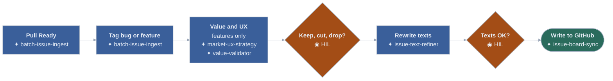

 ·  · 

 `[batch-issue-ingest](skills/batch-issue-ingest/SKILL.md)`
·  `[market-ux-strategy](skills/market-ux-strategy/SKILL.md)`
·  `[value-validator](skills/value-validator/SKILL.md)`
·  `[issue-text-refiner](skills/issue-text-refiner/SKILL.md)`
·  `[issue-board-sync](skills/issue-board-sync/SKILL.md)`
·  keep / cut / drop
·  texts OK?

**↓ Issue pack — one GitHub card per issue (feature or bug)**

### 2 · Parallel delivery — one Cursor worktree per issue

Typically **3** test slots. A fourth run waits. Features: `/feature-delivery`. Bugs: `/bugfix`.

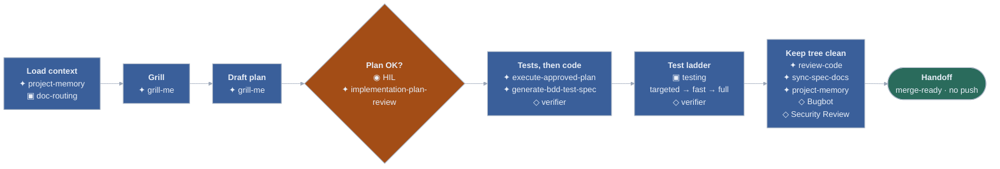

 ·  · 

 `[feature-delivery](skills/workflows/feature-delivery/SKILL.md)`
·  `[bugfix](skills/workflows/bugfix/SKILL.md)`
·  `[project-memory](skills/project-memory/SKILL.md)`
·  `[grill-me](skills/grill-me/SKILL.md)`
·  `[implementation-plan-review](skills/implementation-plan-review/SKILL.md)`
·  `[execute-approved-plan](skills/execute-approved-plan/SKILL.md)`
·  `[generate-bdd-test-spec](skills/generate-bdd-test-spec/SKILL.md)`
·  `[review-code](skills/review-code/SKILL.md)`
·  `[sync-spec-docs](skills/sync-spec-docs/SKILL.md)`
·  `[verifier](agents/verifier.md)`
·  Bugbot
·  Security Review
·  plan OK?

**↓ You ship when the handoff is merge-ready**

### 3 · Land and ship — you trigger both

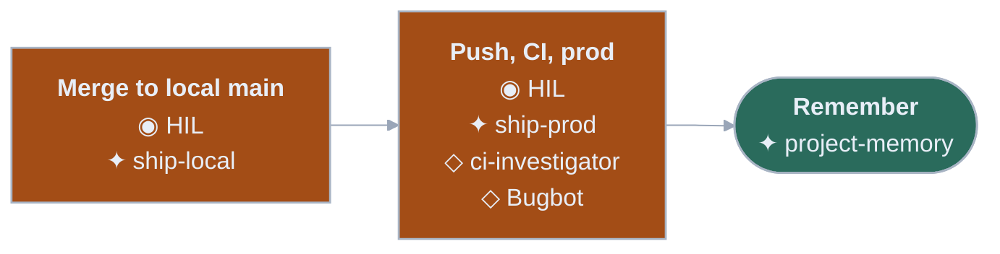

 ·  · 

 `[ship-local](skills/ship-local/SKILL.md)`
·  `[ship-prod](skills/workflows/ship-prod/SKILL.md)`
·  `[project-memory](skills/project-memory/SKILL.md)`
·  ci-investigator
·  Bugbot
·  merge local
·  ship prod

<p id="legend" align="center">
 playbook
&nbsp;·&nbsp;
 you decide
&nbsp;·&nbsp;
 always-on
&nbsp;·&nbsp;
 helper
</p>

Screenshots: full width. Crop (1) the mark + three overview rows + this legend, or (2) any single zoom-in (each chart has a tiny ✦ ◉ ◇ key). Charts are dark-slate cards — they read on GitHub light or dark.

**How parallel work runs**

- **Clean local** `main` is the integration branch. Cursor opens each issue in its own
**worktree + branch**. Agents do not create, switch, or delete worktrees. The only
exception is `/ship-local`, which you trigger — it may merge this feature and remove
**this** worktree only.
- **Day** (in that worktree): grill → draft plan → you `/implementation-plan-review` →
you approve. That yes does **not** authorize merge, push, or production.
- **Night:** tests first (feature: Given/When/Then; bug: failing regression), smallest
code, then the `testing` ladder (targeted → fast → full). Then `review-code`, spec
docs, lessons. Agent **stops** at merge-ready.
- **Test pool:** local tests lease a golden test database from the **project** pool
(typically **three** slots). A fourth run **waits**. Agents run tests without asking;
they wait for a slot instead of skipping. One heavy gate per worktree.
- **You** `/ship-local` (repeat for finished trees) → local `main` holds the batch →
**you** `/ship-prod` (push, watch CI, production, then memory). No force-push. No
skipped gates.
- **Summary file:** every merge-ready handoff writes `## Lessons learned`.
`@project-memory` upserts those into `project_memory.md` and counts `help_count`
when a later cycle actually used the row.

## Contents

| Doc                                             | What it is                                             |
| ----------------------------------------------- | ------------------------------------------------------ |
| [The big picture](#the-big-picture) (this file) | Whole cycle at a glance                                |
| [Legend](#legend) (this file)                   | Skill, HIL, rule, subagent marks                       |
| [Workflows](#workflows) (this file)             | Each named sequence, zoomed in                         |
| [Workflow ideas](#workflow-ideas) (this file)   | Proposed sequences (not installed)                     |
| [docs/architecture.md](docs/architecture.md)    | Portable vs local, layout, install model               |
| [docs/runtime-policy.md](docs/runtime-policy.md)| Local CLI/SDK vs Cursor VMs, Origin, Automations       |
| [docs/install.md](docs/install.md)              | Submodule install, flags, troubleshooting              |
| [docs/rules.md](docs/rules.md)                  | Rule catalog                                           |
| [docs/skills.md](docs/skills.md)                | Skill catalog                                          |
| [docs/agents.md](docs/agents.md)                | Subagents + built-in reviewers                         |
| [docs/hooks.md](docs/hooks.md)                  | Hook catalog                                           |
| [docs/automations.md](docs/automations.md)      | Nightly hygiene stubs (local CLI/SDK)                  |
| [HARNESS.md](HARNESS.md)                        | Agent inventory (one line each) → `.cursor/HARNESS.md` |
| [CONTRIBUTING.md](CONTRIBUTING.md)              | Add a pack                                             |
| [LICENSE](LICENSE)                              | MIT                                                    |

**Templates** (copy into the consumer project, do not edit harness filenames in place):
[AGENTS.md](templates/AGENTS.md) ·
[project_memory.example.md](templates/project_memory.example.md) ·
[doc-routing.local.example.mdc](templates/doc-routing.local.example.mdc) ·
[local-override.example.mdc](templates/local-override.example.mdc) ·
[batch-issue-refine.local.example.md](templates/batch-issue-refine.local.example.md)

**Prompt pack** (installed, not a catalog): [automations/README.md](automations/README.md).

## Workflows

Zoom-ins of [the big picture](#the-big-picture). Start each one in a new agent chat
(`/name` after install). Marks: [legend](#legend). Boxes list **skills** then
**subagents**. Each skill should do **one** job well — orchestrators only sequence.

| Stage   | You want                                    | You type                               |
| ------- | ------------------------------------------- | -------------------------------------- |
| 1       | Clear GitHub issue texts, no code yet       | `/batch-issue-refine`                  |
| 2a      | A new feature or page                       | `/feature-delivery`                    |
| 2b      | Something already shipped is wrong          | `/bugfix`                              |
| 3       | Merge locally, then go to production        | `/ship-local` then `/ship-prod`        |
| 4a      | Faster, less flaky tests                    | `/test-harness-optimize`               |
| 4b      | Nightly hygiene without a feature plan      | Local CLI/SDK (`docs/runtime-policy.md`) |
| Anytime | Cheat sheet, new workflow, pull lab process | `/help` · `/create-workflow` · `/sync` |

---

### 1. Refine issues — `/batch-issue-refine`

Take 5–10 GitHub **Ready** issues and make the text unambiguous. **No code.**
You approve twice. One-time [local config](templates/batch-issue-refine.local.example.md).

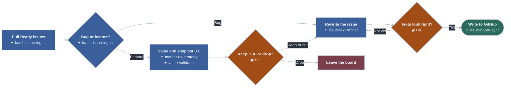

 ·  · 

 `[batch-issue-ingest](skills/batch-issue-ingest/SKILL.md)`
·  `[market-ux-strategy](skills/market-ux-strategy/SKILL.md)`
·  `[value-validator](skills/value-validator/SKILL.md)`
·  `[issue-text-refiner](skills/issue-text-refiner/SKILL.md)`
·  `[issue-board-sync](skills/issue-board-sync/SKILL.md)`

 keep / cut / drop
·  texts look right?

No subagents in this path today (ingest is a script, not an agent).

Orchestrator: [batch-issue-refine](skills/workflows/batch-issue-refine/SKILL.md)

**Improvements**

| Suggestion                                                              | Reuse                           | Add                                                                             |
| ----------------------------------------------------------------------- | ------------------------------- | ------------------------------------------------------------------------------- |
| Split competitor bench from UX mapping — `market-ux-strategy` does both | `doc-routing`, `project-memory` | `competitor-benchmark` (public comps only) · `ux-flow-map` (shortest path only) |
| Fan-out after the list script: one helper per issue body                | `batch-issue-ingest` script     | Cursor `explore` / `generalPurpose`                                             |
| Catch overlapping Ready cards before rewrite                            | issue bodies + labels           | `issue-duplicate-detect` (report only)                                          |
| Ask when bug vs feature is unclear                                      | ingest triage                   | extra HIL, not a new skill                                                      |

---

### 2a. Build a feature — `/feature-delivery`

Plan with you first. The agent builds **only after you approve**.

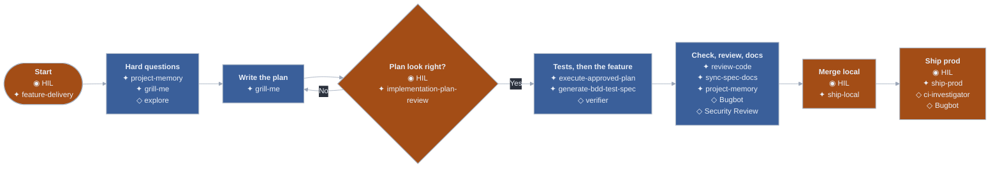

 ·  · 

 `[feature-delivery](skills/workflows/feature-delivery/SKILL.md)`
·  `[project-memory](skills/project-memory/SKILL.md)`
·  `[grill-me](skills/grill-me/SKILL.md)`
·  `[implementation-plan-review](skills/implementation-plan-review/SKILL.md)`
·  `[execute-approved-plan](skills/execute-approved-plan/SKILL.md)`
·  `[generate-bdd-test-spec](skills/generate-bdd-test-spec/SKILL.md)`
·  `[review-code](skills/review-code/SKILL.md)`
·  `[sync-spec-docs](skills/sync-spec-docs/SKILL.md)`
·  `[ship-local](skills/ship-local/SKILL.md)`
·  `[ship-prod](skills/workflows/ship-prod/SKILL.md)`

 explore
·  `[verifier](agents/verifier.md)`
·  Bugbot
·  Security Review
·  ci-investigator

 start
·  plan OK?
·  merge local
·  ship prod

**Improvements**

| Suggestion                                                                          | Reuse                                         | Add                                                      |
| ----------------------------------------------------------------------------------- | --------------------------------------------- | -------------------------------------------------------- |
| Keep night execute thin — it already calls other skills; do not grow it             | `execute-approved-plan`, `testing`            | —                                                        |
| Map module smells before a large feature plan                                       | `deep-modules-clean-architecture`, `grill-me` | `architecture-audit` — [idea](#architecture-improvement) |
| Default grill to an `explore` subagent instead of the parent walking the whole tree | `grill-me`                                    | Cursor `explore` (already on the chart)                  |
| Show `verifier` in the handoff every time, not only when something fails            | `testing`, `verifier`                         | handoff field, not a skill                               |
| Security Review only when the allowlist is sensitive (already the rule)             | `security-basics`                             | keep off the default path                                |
| New UI must use corporate tokens, not one-off colors or chart palettes              | `code-quality`                                | [Frontend refactor](#frontend-refactor)                  |
| Prefer user-story / acceptance docs over file-tree markdown                         | `doc-routing`, `sync-spec-docs`               | [Docs to user stories](#docs-to-user-stories)            |

---

### 2b. Fix a bug — `/bugfix`

Same shape as a feature. First move: a **failing test** that proves the bug.
A tiny one-file fix can skip the long plan — only if **you** ask.

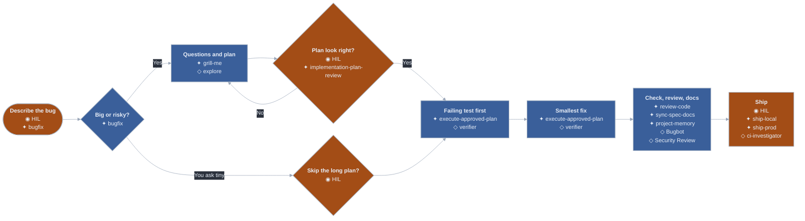

 ·  · 

 `[bugfix](skills/workflows/bugfix/SKILL.md)`
·  `[grill-me](skills/grill-me/SKILL.md)`
·  `[implementation-plan-review](skills/implementation-plan-review/SKILL.md)`
·  `[execute-approved-plan](skills/execute-approved-plan/SKILL.md)`
·  `[review-code](skills/review-code/SKILL.md)`
·  `[sync-spec-docs](skills/sync-spec-docs/SKILL.md)`
·  `[project-memory](skills/project-memory/SKILL.md)`
·  `[ship-local](skills/ship-local/SKILL.md)`
·  `[ship-prod](skills/workflows/ship-prod/SKILL.md)`

 explore
·  `[verifier](agents/verifier.md)`
·  Bugbot
·  Security Review
·  ci-investigator

 describe the bug
·  skip the long plan?
·  plan OK?
·  ship

**Improvements**

| Suggestion                                                      | Reuse               | Add                                                                  |
| --------------------------------------------------------------- | ------------------- | -------------------------------------------------------------------- |
| Isolate reproduce from fix — do not hunt and patch in one skill | `bugfix`, `testing` | `reproduce-bug` (RED proof only)                                     |
| Tell a flake from a product bug before changing code            | `testing`           | `flake-vs-bug` (classify only) → then `flake-hunter` or the fix path |
| CI-only failures start with a log summary                       | `ship-prod`         | `ci-investigator` on the first red box                               |
| Auth/billing/admin bugs always run Security Review              | `security-basics`   | — (already Phase 4c)                                                 |

---

### 3. Ship — `/ship-local` then `/ship-prod`

Shipping is always **your** call. The agent never pushes or deploys on its own.

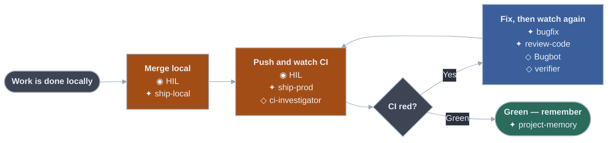

 ·  · 

 `[ship-local](skills/ship-local/SKILL.md)`
·  `[ship-prod](skills/workflows/ship-prod/SKILL.md)`
·  `[bugfix](skills/workflows/bugfix/SKILL.md)`
·  `[review-code](skills/review-code/SKILL.md)`
·  `[project-memory](skills/project-memory/SKILL.md)`

 ci-investigator
·  Bugbot
·  `[verifier](agents/verifier.md)`

 merge local
·  push and watch CI

**Improvements**

| Suggestion                                                              | Reuse            | Add                                                              |
| ----------------------------------------------------------------------- | ---------------- | ---------------------------------------------------------------- |
| Split “watch CI” from “run the deploy command” from Phase 7 memory      | `ship-prod`      | `ci-watch` (report until terminal) — deploy stays in `ship-prod` |
| Name `ci-investigator` on every red run (already optional in the skill) | `ship-prod`      | chart + default, not a new pack agent                            |
| Do not auto-apply Bugbot fixes on default branch                        | Phase 4c policy  | keep HIL                                                         |
| Bump `help_count` only for lessons that helped the CI fix               | `project-memory` | —                                                                |

---

### 4a. Keep tests healthy — `/test-harness-optimize`

Flaky, slow, or thin tests. Never make asserts weaker to go green.

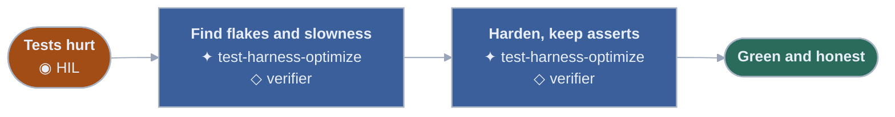

 ·  · 

 `[test-harness-optimize](skills/test-harness-optimize/SKILL.md)`
·  `[verifier](agents/verifier.md)`
·  you start it

**Improvements**

This skill currently does flakes, speed, **and** coverage. Split it — full design:
[Optimize test suite](#optimize-test-suite).

| Suggestion                                                              | Reuse                             | Add                                                                                                       |
| ----------------------------------------------------------------------- | --------------------------------- | --------------------------------------------------------------------------------------------------------- |
| Collect leftover lint / vulns / flake signals on a **green** run        | `testing`, `verifier`             | `green-run-hygiene` (report only)                                                                         |
| One skill per track after that report                                   | `security-basics`, `code-quality` | `lint-debt-fix` · `test-security-findings` · `flake-hunter` · `coverage-gap-fill` · `e2e-merge-redundant` |
| Cut full E2E time by merging overlapping journeys, not by sleeping less | `testing`                         | `e2e-merge-redundant`                                                                                     |
| Never weaken asserts to go green                                        | `testing`                         | keep as a rule                                                                                            |

---

### 4b. Nightly hygiene — local CLI / SDK

Scheduled quality jobs on **this machine** (`launchd` / cron + Cursor CLI or
SDK). Prompt stubs: [automations/README.md](automations/README.md). May open a
**draft PR** for safe test/lint cleanup. Never auth, billing, secrets, or
migrations. Cloud `/automate` is overflow when the laptop is off —
[runtime policy](docs/runtime-policy.md).

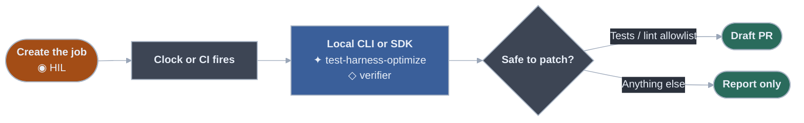

 ·  · 

 `[test-harness-optimize](skills/test-harness-optimize/SKILL.md)`
·  `[verifier](agents/verifier.md)`
·  you schedule the local job

Catalog: [docs/automations.md](docs/automations.md)

**Improvements**

| Suggestion                                                             | Reuse                                            | Add                                       |
| ---------------------------------------------------------------------- | ------------------------------------------------ | ----------------------------------------- |
| One stub per job — do not let one nightly run lint + flakes + security | existing stubs                                   | map each stub to one new test-suite skill |
| Architecture drift has no scheduled job                                | `deep-modules-clean-architecture`, `review-docs` | weekly `architecture-audit` **report**    |
| Security scan stays report-only                                        | `security-basics`, Security scan stub            | `test-security-findings` only after HIL   |
| CI failure triage should start with `ci-investigator`                  | CI failure stub                                  | built-in subagent, not a new pack agent   |
| Do not default the stub to `/automate` (Cursor VM)                     | [runtime policy](docs/runtime-policy.md)         | local `agent -p` / SDK; `/automate` overflow only |

---

### Anytime

| You want                                               | You type                                                     |
| ------------------------------------------------------ | ------------------------------------------------------------ |
| What can I run?                                        | `/help` — map: [HARNESS.md](HARNESS.md) · words: `/glossary` |
| Add a new named sequence                               | `/create-workflow`                                           |
| Pull proven process from a live project into this pack | `/sync`                                                      |

---

## Workflow ideas

Not installed. Author with `/create-workflow` when you want them live.
**One job per skill.** Orchestrators only sequence. Subagents fan out report work;
they do not become mega-skills.

| Idea                                                  | You would type          | Point                                                |
| ----------------------------------------------------- | ----------------------- | ---------------------------------------------------- |
| [Architecture improvement](#architecture-improvement) | `/architecture-improve` | One module smell per run                             |
| [Optimize test suite](#optimize-test-suite)           | `/optimize-test-suite`  | Honest green runs                                    |
| [Frontend refactor](#frontend-refactor)               | `/frontend-refactor`    | Corporate tokens, one UI family per run              |
| [Docs to user stories](#docs-to-user-stories)         | `/docs-to-user-stories` | Stories + tests; retire tech dupes only when covered |
| [App performance](#app-performance)                   | `/performance-optimize` | Measure, then one hotspot                            |

---

### Architecture improvement

Proposed `/architecture-improve`. Incremental structure work — not a rewrite.
You pick **one** smell per run.

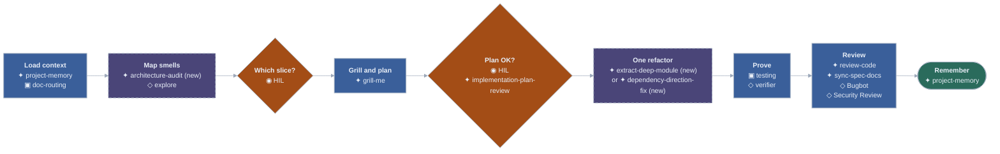

 ·  · 

**Reuse**

| Kind      | What                                                                                                                                         |
| --------- | -------------------------------------------------------------------------------------------------------------------------------------------- |
| Rules     | `deep-modules-clean-architecture` · `code-quality` · `security-basics` · `testing` · `doc-routing` · `core-principles`                       |
| Skills    | `project-memory` · `grill-me` · `implementation-plan-review` · `review-code` · `sync-spec-docs` · `review-docs` · `ship-local` · `ship-prod` |
| Subagents | `explore` (map) · `verifier` (prove) · Bugbot · Security Review when boundaries move                                                         |

**Add** (one job each)

| Skill                      | One job                                                    |
| -------------------------- | ---------------------------------------------------------- |
| `architecture-improve`     | Thin orchestrator only                                     |
| `architecture-audit`       | Report shallow modules, cycles, and layer leaks — no edits |
| `extract-deep-module`      | One extract or collapse per run                            |
| `dependency-direction-fix` | One cycle or wrong-way dependency per run                  |

Do **not** add a skill that “improves architecture” in general. Ship stays `/ship-local`
then `/ship-prod`. Sensitive boundary moves wait for Security Review; do not auto-fix.

---

### Optimize test suite

Proposed `/optimize-test-suite`. Successor to `/test-harness-optimize`.
Goal: a **green** run that is also honest — leftover lint, vulns, flakes, thin
coverage, and redundant E2E journeys are treated as debt, not as success.

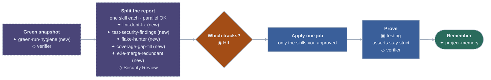

 ·  · 

**Reuse**

| Kind        | What                                                                                                                           |
| ----------- | ------------------------------------------------------------------------------------------------------------------------------ |
| Rules       | `testing` (ladder + never weaker asserts) · `security-basics` · `code-quality`                                                 |
| Skills      | `generate-bdd-test-spec` (new coverage cases) · `review-code` · `project-memory` · current `test-harness-optimize` until split |
| Subagents   | `verifier` on snapshot and prove · Security Review on vuln track · Bugbot if a “fix” looks like a product bug                  |
| Automations | Daily test health · lint hygiene · security scan stubs — one stub per new skill later                                          |

**Add** (one job each)

| Skill                    | One job                                                                                                |
| ------------------------ | ------------------------------------------------------------------------------------------------------ |
| `optimize-test-suite`    | Thin orchestrator only                                                                                 |
| `green-run-hygiene`      | On a green run, collect leftover lint, vulns, flake signals, coverage holes, E2E timings — report only |
| `lint-debt-fix`          | Fix lint / static noise from that report                                                               |
| `test-security-findings` | Triage scanner or test vulns; **stop** before product-code fixes                                       |
| `flake-hunter`           | Isolate and harden flakes; never weaker asserts                                                        |
| `coverage-gap-fill`      | Add tests for critical uncovered paths                                                                 |
| `e2e-merge-redundant`    | Merge overlapping E2E cases so the full suite does not repeat the same journey                         |

HIL after the snapshot, before any track writes. Parallel subagents may **fill** the
report; they must not apply five tracks in one pass. `test-harness-optimize` retires
once the orchestrator exists.

---

### Frontend refactor

Proposed `/frontend-refactor`. Catch one-off UI that crept in during feature work
(buttons, charts, spacing, radius, ad-hoc colors) and fold it back into **one**
corporate token set — light and dark, every app frontend.

Tokens (consumer SSOT, not this pack): **background / midground / foreground**
layers; **primary / secondary / tertiary** colors; spacing scale; corner radius.
Charts use those colors only. Components consume shared classes/tokens; they do
not redefine the look locally.

```mermaid
%%{init: {"theme":"base","themeVariables":{"darkMode":true,"fontFamily":"ui-sans-serif, system-ui, -apple-system, Segoe UI, sans-serif","fontSize":"15px","background":"#2B313C","lineColor":"#9AA6B8","textColor":"#9AA6B8","primaryTextColor":"#E8EEF7","edgeLabelBackground":"#2B313C"},"flowchart":{"curve":"basis","htmlLabels":true,"nodeSpacing":31,"rankSpacing":48,"padding":16,"useMaxWidth":true}}}%%
flowchart LR
  f1["<b>Load tokens</b><br/>✦ project-memory<br/>▣ consumer design-tokens"]
  f2["<b>Map outliers</b><br/>✦ design-token-audit (new)<br/>◇ explore"]
  f3{"<b>Tokens complete?</b><br/>◉ HIL"}
  f4["<b>Centralize CSS</b><br/>✦ design-token-ssot (new)<br/>light + dark"]
  f5{"<b>Which family?</b><br/>◉ HIL<br/>buttons · charts · one screen"}
  f6["<b>Align one family</b><br/>✦ ui-outlier-align (new)<br/>or ✦ chart-theme-align (new)"]
  f7["<b>Prove</b><br/>▣ testing<br/>◇ verifier"]
  f8(["<b>Remember</b><br/>✦ project-memory"])

  f1 --> f2 --> f3
  f3 -->|No| f4 --> f5
  f3 -->|Yes| f5 --> f6 --> f7 --> f8

  classDef skill fill:#3A5F9A,stroke:#A8B4C4,stroke-width:1.4px,color:#E8EEF7
  classDef proposed fill:#4A4578,stroke:#A8B4C4,stroke-width:1.4px,color:#E8EEF7,stroke-dasharray:6 4
  classDef hil fill:#A34D16,stroke:#A8B4C4,stroke-width:1.4px,color:#E8EEF7
  classDef done fill:#2A6B5C,stroke:#A8B4C4,stroke-width:1.4px,color:#E8EEF7
  class f1,f7 skill
  class f2,f4,f6 proposed
  class f3,f5 hil
  class f8 done
```

 ·  · 

**Reuse**

| Kind      | What                                                                                            |
| --------- | ----------------------------------------------------------------------------------------------- |
| Rules     | `code-quality` · `testing` · `deep-modules-clean-architecture` · `doc-routing`                  |
| Skills    | `project-memory` · `grill-me` · `implementation-plan-review` · `review-code` · `sync-spec-docs` |
| Subagents | `explore` (find one-off CSS/components) · `verifier` (visual/unit if the project has them)      |
| Consumer  | Design-token CSS + a local rule pointing at it (brand does **not** belong in this pack)         |

**Add** (one job each)

| Skill                | One job                                                                                        |
| -------------------- | ---------------------------------------------------------------------------------------------- |
| `frontend-refactor`  | Thin orchestrator only                                                                         |
| `design-token-audit` | Report outliers vs tokens (hard-coded colors, extra radius, one-off buttons/charts) — no edits |
| `design-token-ssot`  | One shared token file: light/dark, layers, primary/secondary/tertiary, spacing, radius         |
| `ui-outlier-align`   | Restyle **one** component family to those tokens (e.g. buttons, not the whole app)             |
| `chart-theme-align`  | Point charts at the same color tokens — no private palettes                                    |

Do **not** add a skill that “fixes the frontend.” One family per run. New features
must consume tokens (call this out in `/feature-delivery` plans). No new hex values
in component files after the SSOT exists.

---

### Docs to user stories

Proposed `/docs-to-user-stories`. Shrink technical markdown. Prefer **user stories
and acceptance** (closer to product design and improvement). **Code** is the
implementation map. **Unit, integration, and E2E tests** are the technical
contract. Thin system contracts stay only where `doc-routing` already allows
(security, money, ingest, critical E2E).

**On the ~20% cap.** Treat it as a **review-size throttle**, not a quality target.
The risky assumption is “coverage might be thin, so always delete only 20%.”
Safer rule: **do not retire a technical doc until tests (or a remaining thin
contract) cover that behavior.** If coverage is already high, a larger slice is
fine. If coverage is thin, the first run may be mostly **writing tests**, not
deleting docs. A small per-run cap still helps reviews stay reviewable.

```mermaid
%%{init: {"theme":"base","themeVariables":{"darkMode":true,"fontFamily":"ui-sans-serif, system-ui, -apple-system, Segoe UI, sans-serif","fontSize":"15px","background":"#2B313C","lineColor":"#9AA6B8","textColor":"#9AA6B8","primaryTextColor":"#E8EEF7","edgeLabelBackground":"#2B313C"},"flowchart":{"curve":"basis","htmlLabels":true,"nodeSpacing":31,"rankSpacing":48,"padding":16,"useMaxWidth":true}}}%%
flowchart LR
  d1["<b>Inventory docs</b><br/>✦ doc-inventory (new)<br/>◇ explore"]
  d2["<b>Coverage gate</b><br/>✦ docs-coverage-gate (new)<br/>◇ verifier"]
  d3{"<b>Which slice?</b><br/>◉ HIL<br/>size follows coverage"}
  d4["<b>Fill test holes</b><br/>✦ generate-bdd-test-spec<br/>✦ coverage-gap-fill (new)"]
  d5["<b>Rewrite as stories</b><br/>✦ story-migrate-slice (new)"]
  d6["<b>Retire tech dupes</b><br/>✦ tech-doc-retire (new)<br/>only if tests cover it"]
  d7["<b>Remember</b><br/>✦ project-memory<br/>✦ review-docs"]

  d1 --> d2 --> d3
  d3 -->|Tests missing| d4 --> d5
  d3 -->|Covered| d5 --> d6 --> d7

  classDef skill fill:#3A5F9A,stroke:#A8B4C4,stroke-width:1.4px,color:#E8EEF7
  classDef proposed fill:#4A4578,stroke:#A8B4C4,stroke-width:1.4px,color:#E8EEF7,stroke-dasharray:6 4
  classDef hil fill:#A34D16,stroke:#A8B4C4,stroke-width:1.4px,color:#E8EEF7
  classDef done fill:#2A6B5C,stroke:#A8B4C4,stroke-width:1.4px,color:#E8EEF7
  class d4,d7 skill
  class d1,d2,d5,d6 proposed
  class d3 hil
```

 ·  · 

**Reuse**

| Kind        | What                                                                                         |
| ----------- | -------------------------------------------------------------------------------------------- |
| Rules       | `doc-routing` (product story first) · `testing` · `core-principles`                          |
| Skills      | `review-docs` · `sync-spec-docs` · `generate-bdd-test-spec` · `project-memory`               |
| Subagents   | `explore` (find duplicate inventories) · `verifier` (prove tests still express the behavior) |
| Automations | Spec acceptance drift stub — report story vs code, not more encyclopedia                     |

**Add** (one job each)

| Skill                  | One job                                                                        |
| ---------------------- | ------------------------------------------------------------------------------ |
| `docs-to-user-stories` | Thin orchestrator only                                                         |
| `doc-inventory`        | Classify each doc: story, thin contract, duplicate-of-code, duplicate-of-tests |
| `docs-coverage-gate`   | For each proposed deletion: which tests cover it? Missing → do not delete      |
| `story-migrate-slice`  | Rewrite **one** topic as user story + acceptance                               |
| `tech-doc-retire`      | Remove or shrink technical markdown only after the gate passes                 |

Do **not** add a skill that “rewrites all docs.” Do not delete behavior that has
no test and no remaining contract. `coverage-gap-fill` is listed under
[Optimize test suite](#optimize-test-suite) — reuse it, do not clone it.

---

### App performance

Proposed `/performance-optimize`. Measure first. Then fix **one** slow path:
algorithm, workflow, or SQL. Guessing is not a skill.

```mermaid
%%{init: {"theme":"base","themeVariables":{"darkMode":true,"fontFamily":"ui-sans-serif, system-ui, -apple-system, Segoe UI, sans-serif","fontSize":"15px","background":"#2B313C","lineColor":"#9AA6B8","textColor":"#9AA6B8","primaryTextColor":"#E8EEF7","edgeLabelBackground":"#2B313C"},"flowchart":{"curve":"basis","htmlLabels":true,"nodeSpacing":31,"rankSpacing":48,"padding":16,"useMaxWidth":true}}}%%
flowchart LR
  p1["<b>Load context</b><br/>✦ project-memory<br/>▣ doc-routing"]
  p2["<b>Profile</b><br/>✦ perf-profile (new)<br/>◇ explore"]
  p3["<b>Split the report</b><br/>one skill each<br/>✦ slow-query-find (new)<br/>✦ slow-path-find (new)"]
  p4{"<b>Which hotspot?</b><br/>◉ HIL"}
  p5["<b>One fix</b><br/>✦ perf-fix-query (new)<br/>or ✦ perf-fix-hotpath (new)"]
  p6["<b>Prove faster</b><br/>same profiler + ▣ testing<br/>◇ verifier"]
  p7(["<b>Remember</b><br/>✦ project-memory"])

  p1 --> p2 --> p3 --> p4 --> p5 --> p6 --> p7

  classDef skill fill:#3A5F9A,stroke:#A8B4C4,stroke-width:1.4px,color:#E8EEF7
  classDef proposed fill:#4A4578,stroke:#A8B4C4,stroke-width:1.4px,color:#E8EEF7,stroke-dasharray:6 4
  classDef hil fill:#A34D16,stroke:#A8B4C4,stroke-width:1.4px,color:#E8EEF7
  classDef done fill:#2A6B5C,stroke:#A8B4C4,stroke-width:1.4px,color:#E8EEF7
  class p1,p6 skill
  class p2,p3,p5 proposed
  class p4 hil
  class p7 done
```

 ·  · 

**Reuse**

| Kind      | What                                                                                                                                 |
| --------- | ------------------------------------------------------------------------------------------------------------------------------------ |
| Rules     | `testing` · `code-quality` · `security-basics` (no secrets in traces) · `deep-modules-clean-architecture`                            |
| Skills    | `grill-me` · `implementation-plan-review` · `execute-approved-plan` (if the fix needs a contract) · `review-code` · `project-memory` |
| Subagents | `explore` (find the hot path in code) · `verifier` (ladder still green) · Bugbot if the “faster” change looks like a behavior bug    |
| Consumer  | Profiler / EXPLAIN / APM commands — discover from README, do not invent                                                              |

**Add** (one job each)

| Skill                  | One job                                                        |
| ---------------------- | -------------------------------------------------------------- |
| `performance-optimize` | Thin orchestrator only                                         |
| `perf-profile`         | Capture before numbers (CPU, render, query time) — report only |
| `slow-query-find`      | Rank slow SQL / N+1 / missing indexes — no edits               |
| `slow-path-find`       | Rank slow algorithms and workflows — no edits                  |
| `perf-fix-query`       | One query or index change; prove with the same profiler        |
| `perf-fix-hotpath`     | One algorithm or workflow change; prove with the same profiler |

Do **not** add a skill that “makes the app faster.” No fix without a before
measurement. No “optimize everything we saw.” Ship still `/ship-local` then
`/ship-prod`.

## Quick install

Full flags, clone, CI, troubleshooting: [docs/install.md](docs/install.md).

```bash
git submodule add git@github.com:RaphaelBecker/cursor-harness.git vendor/cursor-harness
./vendor/cursor-harness/install.sh --target . --mode symlink --with-agents
```

Requires `bash`, `python3` (stdlib), and `git`.

## Layout

```text
cursor-harness/
├── README.md           # workflows + this contents table
├── HARNESS.md          # agent inventory → .cursor/HARNESS.md
├── CONTRIBUTING.md
├── install.sh
├── manifest.yaml       # pack registry (what install.sh copies)
├── rules/              # *.mdc
├── skills/             # SKILL.md packs + workflows/
├── agents/
├── automations/        # prompt stubs
├── hooks/
├── templates/
└── docs/               # catalogs + architecture + install
```

## License

MIT — [LICENSE](LICENSE).
